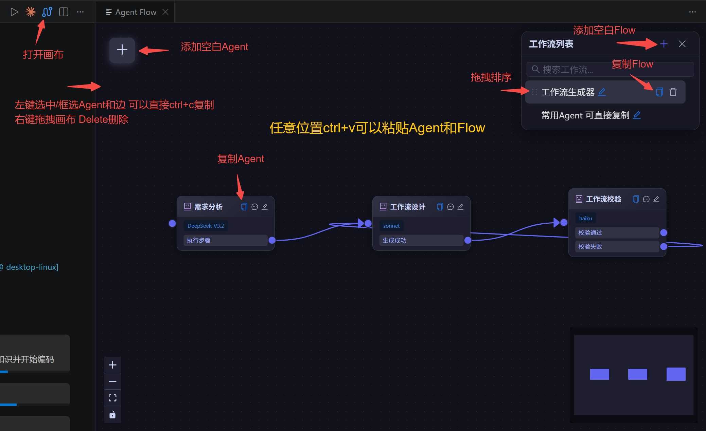
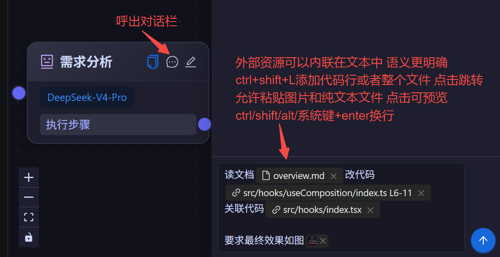
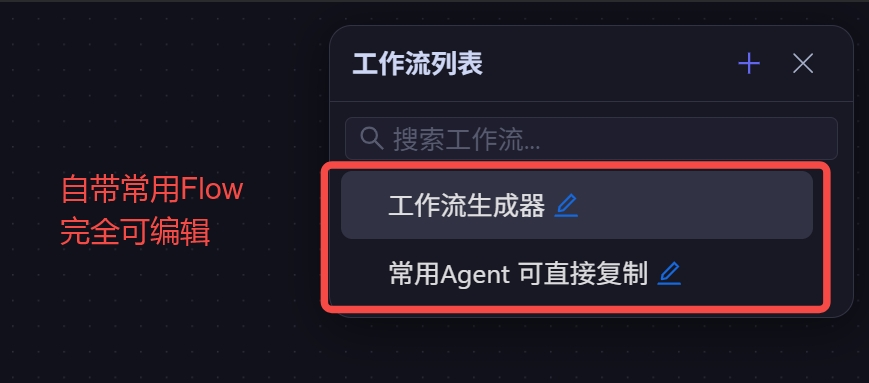

# Agent Flow

Agent Flow 被定义为 Agent 作为节点构成的有向图，此插件提供可视化构建和调用 Agent Flow 的能力。

Agent 间模型、上下文等可以做到完全隔离，Flow 可以从任意位置启动。

通过 Claude SDK 使用 AI 能力，需要正确配置环境变量。下载 `@anthropic-ai/claude-code` ，如果能通过命令行进行 AI 对话，便可正常使用插件。

---

## 安装

**方式一：直接下载 VSIX**

前往 [Releases 页面](https://github.com/FanetheDivine/agent-flow/releases/) 下载最新的 `.vsix` 文件。

**方式二：从源码构建**

```bash
git clone https://github.com/FanetheDivine/agent-flow.git
cd agent-flow
pnpm install
pnpm build-extension   # 生成 .vsix 文件
```

**安装到 VSCode**

在 VSCode 扩展面板右上角菜单（`···`）中选择 **"从 VSIX 安装"**，选中下载或构建好的 `.vsix` 文件即可。

---

## 界面速览





## 主要功能

### 1. 可视化编辑工作流

- **框选 / 拖拽画布**：左键拖空白处框选节点，中键或右键拖拽平移画布。
- **模型自由搭配**：每个 Agent 独立配置模型（opus / sonnet / haiku）与思考强度（effort）。
- **上下文隔离**：每个 Agent 有自己独立的对话上下文；跨 Agent 共享数据通过 `shareValues`（由 Agent 自己读写）。
- **连线约束**：每个 output 最多连一条出边；`next_agent` 允许指向自身以支持循环。

### 2. 自由复制粘贴

- **Agent 节点**：选中一个或多个节点 `Ctrl+C` / `Ctrl+V`，内部连接关系会被保留，ID 自动重映射，指向外部的连接被丢弃。
- **整条 Flow**：工作流列表的复制按钮把 Flow 序列化成 JSON，直接在画布空白处 `Ctrl+V` 即可导入（支持单个对象或数组批量导入）。
- **直接粘贴文件**：在聊天输入框粘贴图片、文本等任意文件，都会作为附件附加到消息上。

### 3. 内置示例工作流

插件自带两条内置 Flow（不可删除，位于列表顶部）：

- **工作流生成器**：`需求分析 → 工作流设计 → 工作流校验`。描述一下你的需求，它会自动拆步骤、生成符合 FlowSchema 的 JSON，再校验一遍——粘贴到画布即可得到一条可运行的新 Flow。
- **常用 Agent 可直接复制**：`模型理解能力测试`、`飞书通知` 等示例 Agent，可复制粘贴到你自己的 Flow 里当零件用。

### 4. 编辑器联动

在 VSCode 编辑器中按 `Ctrl+Shift+L`（macOS：`Cmd+Shift+L`）：

- **有选中文字**：将选区作为带行号的代码引用追加到当前活跃的聊天输入框。
- **无选中文字**：将当前文件的全部内容作为代码引用追加，不附带行号。

---

## 计划中功能

- **对话 fork**：在 Agent 对话中从任意一条消息分叉出新分支，同时保留原路径，用来对比不同提示或不同模型的效果。

---

## 快捷键

### VSCode 编辑器

| 快捷键                         | 行为                                                                     |
| ------------------------------ | ------------------------------------------------------------------------ |
| `Ctrl+Shift+L` / `Cmd+Shift+L` | 有选中文字：将选区作为带行号的代码引用发送到活跃输入框；无选中：发送整个文件 |

### 画布

| 快捷键                | 行为                                            |
| --------------------- | ----------------------------------------------- |
| `Ctrl+C`              | 复制选中的一个或多个 Agent 节点                 |
| `Ctrl+V`              | 画布内粘贴 Agent，画布空白处粘贴 Flow JSON 导入 |
| `Delete`              | 删除选中的节点或连线                            |
| `Ctrl` / `Cmd` + 点击 | 多选节点                                        |
| 左键拖空白            | 框选节点                                        |
| 中键 / 右键拖拽       | 平移画布                                        |

### 聊天输入框

| 快捷键       | 行为                                 |
| ------------ | ------------------------------------ |
| `Enter`      | 发送消息 / 提交 AskUserQuestion 回答 |
| `Ctrl+Enter` | 换行                                 |
| 粘贴文件     | 作为附件附加到消息                   |
