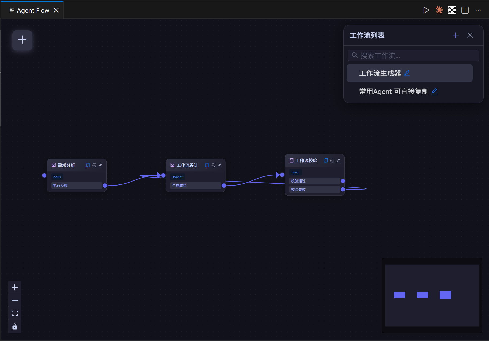
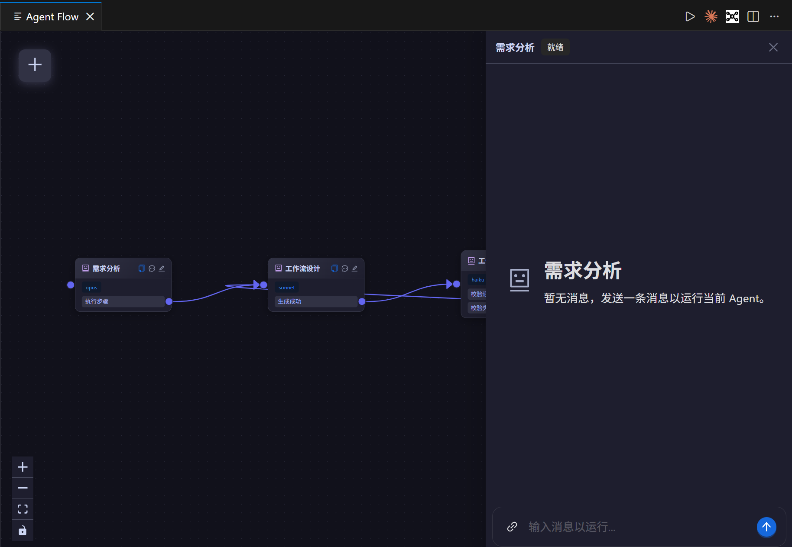

# Agent Flow

用 Agent 编排工作流的 VSCode 插件。把一个任务拆成多个 Agent，按图连接，每个 Agent 可以用不同的模型、各自独立的上下文，跑起来就是一条可视化的工作流。

---

## 界面速览

1. **左上角 `+`**：新建 Agent 节点。
2. **节点头部三个图标**：复制节点 / 打开聊天 / 编辑 Agent。
3. **节点底部彩色端口**：每个端口是一条 `output` 分支，拖到下一个节点的左侧端口即可连线。
4. **右上角工作流列表**：新建、搜索、重命名、复制为 JSON、删除；底部小圆点显示当前 Flow 的运行状态。
5. **左下角按钮**：缩放 / 自适应 / 锁定画布。
6. **右下角小地图**：快速定位。

1. **节点高亮（绿色描边）**：当前正在运行的 Agent。
2. **ChatDrawer**：从节点的聊天图标打开；发送第一条消息即以该节点为起点启动 Flow。
3. **顶部状态标签**：显示 Agent 当前阶段（就绪 / 运行中 / 等待输入 等）。
4. **底部输入框**：文本 / 附件 / 代码引用都可以直接粘贴或输入，`Enter` 发送、`Shift+Enter` 换行。

---

## 主要功能

### 1. 可视化编辑工作流

- **框选 / 拖拽画布**：左键拖空白处框选节点，中键或右键拖拽平移画布。
- **模型自由搭配**：每个 Agent 独立配置模型（opus / sonnet / haiku）与思考强度（effort）。
- **上下文隔离**：每个 Agent 有自己独立的对话上下文；跨 Agent 共享数据通过 `shareValues`（由 Agent 自己读写）。
- **连线约束**：每个 output 最多连一条出边；`next_agent` 允许指向自身以支持循环。

### 2. 自由复制粘贴

- **Agent 节点**：选中一个或多个节点 `Ctrl+C` / `Ctrl+V`，内部连接关系会被保留，ID 自动重映射，指向外部的连接被丢弃。
- **整条 Flow**：工作流列表的复制按钮把 Flow 序列化成 JSON，直接在画布空白处 `Ctrl+V` 即可导入（支持单个对象或数组批量导入）。
- **直接粘贴文件**：在聊天输入框粘贴图片、文本等任意文件，都会作为附件附加到消息上。

### 3. 内置示例工作流

插件自带两条内置 Flow（不可删除，位于列表顶部）：

- **工作流生成器**：`需求分析 → 工作流设计 → 工作流校验`。描述一下你的需求，它会自动拆步骤、生成符合 FlowSchema 的 JSON，再校验一遍——粘贴到画布即可得到一条可运行的新 Flow。
- **常用 Agent 可直接复制**：`模型理解能力测试`、`飞书通知` 等示例 Agent，可复制粘贴到你自己的 Flow 里当零件用。

### 4. 编辑器联动

在任意 VSCode 编辑器里选中一段代码，按 `Ctrl+Shift+L`（macOS：`Cmd+Shift+L`），选区会作为带行号的代码引用追加到当前活跃的聊天输入框。

---

## 计划中功能

- **对话 fork**：在 Agent 对话中从任意一条消息分叉出新分支，同时保留原路径，用来对比不同提示或不同模型的效果。

---

## 快捷键

### VSCode 编辑器

| 快捷键 | 行为 |
| --- | --- |
| `Ctrl+Shift+L` / `Cmd+Shift+L` | 将编辑器选区作为代码引用发送到活跃聊天输入框 |

### 画布

| 快捷键 | 行为 |
| --- | --- |
| `Ctrl+C` | 复制选中的一个或多个 Agent 节点 |
| `Ctrl+V` | 画布内粘贴 Agent，画布空白处粘贴 Flow JSON 导入 |
| `Delete` | 删除选中的节点或连线 |
| `Ctrl` / `Cmd` + 点击 | 多选节点 |
| 左键拖空白 | 框选节点 |
| 中键 / 右键拖拽 | 平移画布 |

### 聊天输入框

| 快捷键 | 行为 |
| --- | --- |
| `Enter` | 发送消息 / 提交 AskUserQuestion 回答 |
| `Shift+Enter` | 换行 |
| 粘贴文件 | 作为附件附加到消息 |
